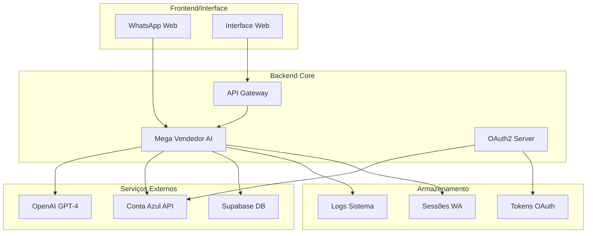

# 🤖 NOVO AI AUTOMATION - Sistema de Automação Inteligente

Sistema completo de automação de vendas com IA, integração WhatsApp e Conta Azul para a loja **Novo Israel** (produtos evangélicos).

## 📋 Visão Geral

Este projeto combina múltiplas tecnologias para criar um sistema de vendas automatizado que:

- **Mega Vendedor AI**: Bot inteligente para WhatsApp com IA generativa
- **Integração Conta Azul**: Sincronização de produtos e clientes
- **Sistema OAuth2**: Autenticação segura com APIs externas
- **Base de Dados**: Armazenamento de clientes e transações

## 🏗️ Arquitetura do Sistema



## 🚀 Tecnologias Utilizadas

### Backend
- **Node.js** + **TypeScript** - Runtime e linguagem principal
- **Express.js** - Framework web
- **Baileys** - Biblioteca WhatsApp Web
- **OpenAI API** - IA generativa (GPT-4)
- **Supabase** - Banco de dados PostgreSQL
- **Axios** - Cliente HTTP

### Autenticação & APIs
- **OAuth 2.0** - Autenticação Conta Azul
- **JWT** - Tokens de sessão
- **Node-cron** - Agendamento de tarefas

### Desenvolvimento
- **ESLint** + **Prettier** - Qualidade de código
- **Jest** - Testes unitários
- **Nodemon** - Desenvolvimento
- **TypeScript** - Tipagem estática

## 📁 Estrutura do Projeto

```
NOVO-AI-AUTOMATION/
├── 📁 agentes/
│   └── 📁 dev1_alex/
│       └── 📁 mega_vendedor_ai/          # Bot principal WhatsApp
│           ├── 📁 src/
│           │   ├── 📁 services/          # Serviços (IA, Conta Azul, etc.)
│           │   ├── 📁 utils/             # Utilitários
│           │   ├── 📁 types/             # Interfaces TypeScript
│           │   └── 📁 whatsapp/          # Handler WhatsApp
│           └── 📄 package.json
├── 📁 docs/                              # Documentação
├── 📁 scripts/                           # Scripts utilitários
├── 📁 src/                               # Código principal
│   ├── 📁 lib/                           # Bibliotecas compartilhadas
│   └── 📁 jobs/                          # Jobs agendados
├── 📄 server.js                          # Servidor principal
├── 📄 package.json                       # Dependências raiz
└── 📄 README.md                          # Este arquivo
```

## ⚙️ Configuração e Instalação

### 1. Pré-requisitos
- Node.js >= 18.0.0
- npm >= 8.0.0
- Conta Conta Azul (DEV/PROD)
- Chave API OpenAI
- Projeto Supabase

### 2. Instalação

```bash
# Clone o repositório
git clone <url-do-repositorio>
cd NOVO-AI-AUTOMATION

# Instale dependências raiz
npm install

# Instale dependências do Mega Vendedor AI
cd agentes/dev1_alex/mega_vendedor_ai
npm install
cd ../../..

# Configure variáveis de ambiente
cp env.dev.template .env
# Edite o arquivo .env com suas credenciais
```

### 3. Configuração de Ambiente

Crie um arquivo `.env` baseado no template:

```env
# Conta Azul OAuth
CLIENT_ID=seu_client_id
CLIENT_SECRET=seu_client_secret
REDIRECT_URI=http://localhost:3001/oauth/callback

# OpenAI
OPENAI_API_KEY=sua_chave_openai

# Supabase
SUPABASE_URL=sua_url_supabase
SUPABASE_KEY=sua_chave_supabase

# WhatsApp
WA_SESSION_DIR=./.wa_auth
```

## 🚀 Como Executar

### Desenvolvimento

```bash
# 1. Iniciar servidor OAuth
npm run oauth:callback

# 2. Gerar URL de autorização
npm run oauth:url

# 3. Autorizar aplicação no navegador
# 4. Trocar code por tokens
npm run oauth:exchange -- <COLE_O_CODE_AQUI>

# 5. Iniciar servidor principal
npm start

# 6. Iniciar Mega Vendedor AI (em terminal separado)
cd agentes/dev1_alex/mega_vendedor_ai
npm run dev
```

### Produção

```bash
# Configurar ambiente de produção
npm run prod:env

# Build do Mega Vendedor AI
cd agentes/dev1_alex/mega_vendedor_ai
npm run build

# Iniciar serviços
npm start
```

## 🔄 Fluxos Principais

### 1. Fluxo de Vendas WhatsApp
1. Cliente envia mensagem no WhatsApp
2. Sistema detecta perfil do cliente (Pastor, Jovem, Mãe, Neutro)
3. IA gera resposta personalizada
4. Sistema busca produtos relevantes
5. Cliente recebe oferta com desconto personalizado

### 2. Fluxo OAuth Conta Azul
1. Sistema gera URL de autorização
2. Usuário autoriza no navegador
3. Sistema recebe código de autorização
4. Código é trocado por access/refresh tokens
5. Tokens são salvos e renovados automaticamente

### 3. Fluxo de Integração de Produtos
1. Sistema consulta produtos da Conta Azul
2. Produtos são indexados para busca
3. IA usa catálogo para recomendações
4. Vendas são sincronizadas de volta

## 📊 APIs Disponíveis

### Servidor Principal (porta 5000)
- `GET /health` - Status geral
- `GET /health/oauth` - Status OAuth
- `GET /oauth/dev-url` - URL de autorização
- `GET /auth/start` - Iniciar autorização
- `GET /callback` - Callback OAuth

### Mega Vendedor AI
- Webhook WhatsApp integrado
- Processamento de mensagens em tempo real
- Integração com IA generativa

## 🗄️ Banco de Dados

### Tabelas Principais (Supabase)
- **customers** - Clientes/leads
- **products** - Catálogo de produtos
- **transactions** - Vendas realizadas
- **conversations** - Histórico de conversas

## 🔧 Scripts Disponíveis

```bash
# Desenvolvimento
npm run dev              # Servidor com nodemon
npm run dev:env          # Copiar template DEV

# OAuth
npm run oauth:callback   # Servidor callback
npm run oauth:url        # Gerar URL autorização
npm run oauth:exchange   # Trocar code por tokens

# Produção
npm run prod:env         # Copiar template PROD
npm start               # Servidor produção

# Mega Vendedor AI
cd agentes/dev1_alex/mega_vendedor_ai
npm run dev             # Desenvolvimento
npm run build           # Build produção
npm run test            # Testes
```

## 🚨 Troubleshooting

### Erro "invalid_client" OAuth
- Verifique se CLIENT_ID e CLIENT_SECRET estão corretos
- Confirme se a aplicação está registrada na Conta Azul

### Erro "invalid_token" 
- Tokens expirados - execute renovação manual
- Verifique se o arquivo tokens.json existe

### WhatsApp não conecta
- Verifique se o QR code foi escaneado
- Confirme se a sessão não expirou
- Verifique logs de erro

### IA não responde
- Verifique OPENAI_API_KEY
- Confirme se há créditos na conta OpenAI
- Verifique logs de erro da API

## 📈 Monitoramento

### Logs
- Logs de WhatsApp: `agentes/dev1_alex/mega_vendedor_ai/logs/`
- Logs OAuth: Console do servidor principal
- Logs de erro: Console + arquivos de log

### Métricas
- Mensagens processadas por minuto
- Taxa de conversão de vendas
- Uptime dos serviços
- Uso de tokens OpenAI

## 🔒 Segurança

- Tokens OAuth armazenados localmente (não commitados)
- Sessões WhatsApp criptografadas
- Rate limiting implementado
- Validação de entrada de dados
- Logs de auditoria

## 🤝 Contribuição

1. Fork o projeto
2. Crie uma branch para sua feature
3. Commit suas mudanças
4. Push para a branch
5. Abra um Pull Request

## 📄 Licença

MIT License - veja arquivo LICENSE para detalhes.

## 📞 Suporte

Para suporte técnico ou dúvidas:
- Abra uma issue no GitHub
- Consulte a documentação em `/docs`
- Verifique logs de erro

---

**Desenvolvido com ❤️ para a Loja Novo Israel**
