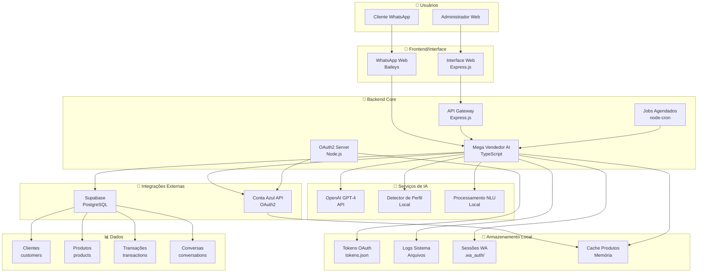
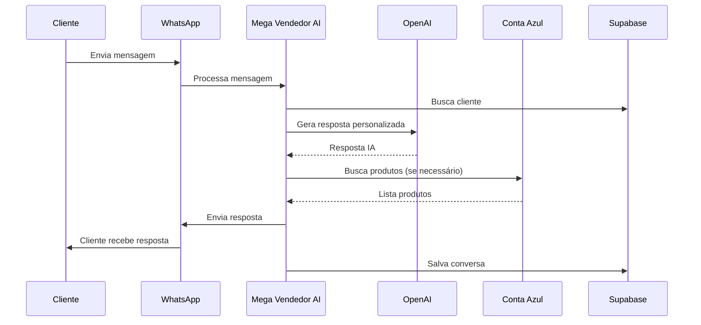
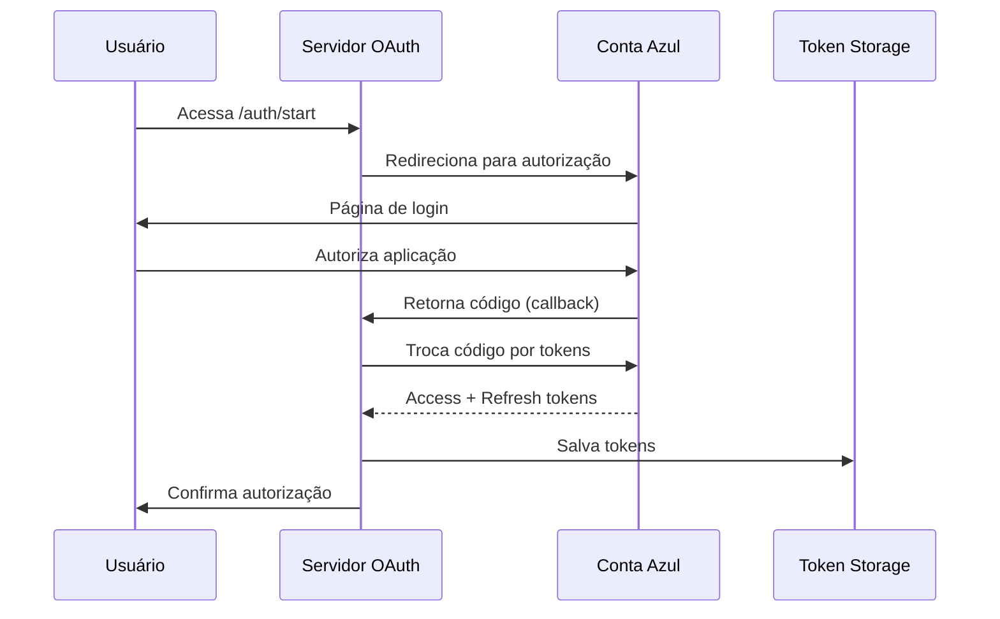

# 🏗️ Arquitetura do Sistema NOVO AI AUTOMATION

## Diagrama de Arquitetura Geral

## Fluxo de Dados Detalhado

### 1. Fluxo de Mensagem WhatsApp

### 2. Fluxo OAuth Conta Azul

## Componentes do Sistema

### 🤖 Mega Vendedor AI
- **Responsabilidade**: Processamento de mensagens WhatsApp
- **Tecnologias**: TypeScript, Baileys, OpenAI
- **Funcionalidades**:
  - Detecção de perfil do cliente
  - Geração de respostas personalizadas
  - Busca de produtos
  - Gestão de conversas

### 🔐 OAuth2 Server
- **Responsabilidade**: Autenticação com Conta Azul
- **Tecnologias**: Node.js, Express
- **Funcionalidades**:
  - Geração de URLs de autorização
  - Troca de códigos por tokens
  - Renovação automática de tokens
  - Gestão de sessões

### 🌐 API Gateway
- **Responsabilidade**: Interface web e APIs
- **Tecnologias**: Express.js
- **Funcionalidades**:
  - Health checks
  - Status de serviços
  - Webhooks
  - Métricas

### 🗄️ Banco de Dados (Supabase)
- **Tecnologia**: PostgreSQL
- **Tabelas**:
  - `customers` - Dados dos clientes
  - `products` - Catálogo de produtos
  - `transactions` - Vendas realizadas
  - `conversations` - Histórico de conversas

## Padrões Arquiteturais

### 1. Microserviços
- Cada componente tem responsabilidade específica
- Comunicação via APIs REST
- Desenvolvimento independente

### 2. Event-Driven
- Processamento assíncrono de mensagens
- Jobs agendados para manutenção
- Webhooks para integrações

### 3. Repository Pattern
- Abstração de acesso a dados
- Facilita testes e manutenção
- Suporte a múltiplas fontes

### 4. Strategy Pattern
- Diferentes estratégias de resposta por perfil
- Detecção de intenções modular
- Fácil extensão de funcionalidades

## Considerações de Escalabilidade

### Horizontal
- Múltiplas instâncias do Mega Vendedor AI
- Load balancer para WhatsApp
- Cache distribuído

### Vertical
- Otimização de queries
- Compressão de dados
- Pool de conexões

### Monitoramento
- Logs centralizados
- Métricas de performance
- Alertas automáticos

## Segurança

### Autenticação
- OAuth 2.0 para APIs externas
- JWT para sessões internas
- Rate limiting

### Dados
- Criptografia de tokens
- Validação de entrada
- Sanitização de dados

### Comunicação
- HTTPS obrigatório
- Validação de webhooks
- Logs de auditoria
