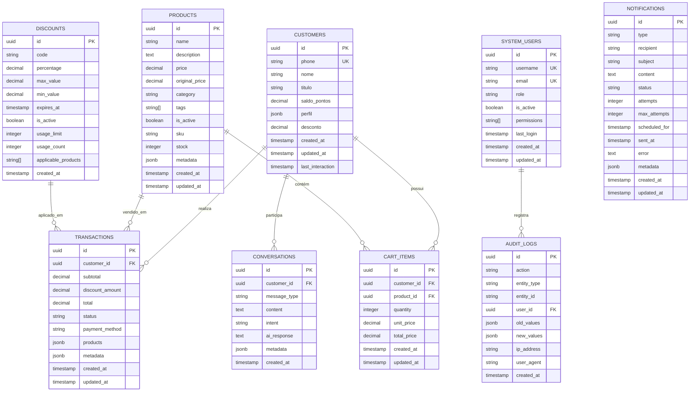

# 🗄️ Banco de Dados - Schema e Relacionamentos

## Diagrama ER (Entidade-Relacionamento)



## Tabelas Detalhadas

### 📋 CUSTOMERS (Clientes)

**Propósito**: Armazena dados dos clientes/leads do sistema.

| Campo | Tipo | Descrição | Restrições |
|-------|------|-----------|------------|
| `id` | `uuid` | Identificador único | PK, NOT NULL |
| `phone` | `string` | Telefone do cliente | UK, NOT NULL |
| `nome` | `string` | Nome do cliente | NULLABLE |
| `titulo` | `string` | Título (Pastor, Bispo, etc.) | NULLABLE |
| `saldo_pontos` | `decimal(10,2)` | Saldo de pontos (1 ponto = R$1) | DEFAULT 0 |
| `perfil` | `jsonb` | Perfil detectado (pastor, jovem, mãe, neutro) | NULLABLE |
| `desconto` | `decimal(5,2)` | Percentual de desconto personalizado | DEFAULT 0 |
| `created_at` | `timestamp` | Data de criação | NOT NULL |
| `updated_at` | `timestamp` | Data de atualização | NOT NULL |
| `last_interaction` | `timestamp` | Última interação | NULLABLE |

**Índices**:
- `idx_customers_phone` - Busca por telefone
- `idx_customers_titulo` - Busca por título
- `idx_customers_last_interaction` - Ordenação por interação

### 📦 PRODUCTS (Produtos)

**Propósito**: Catálogo de produtos sincronizado com Conta Azul.

| Campo | Tipo | Descrição | Restrições |
|-------|------|-----------|------------|
| `id` | `uuid` | Identificador único | PK, NOT NULL |
| `name` | `string` | Nome do produto | NOT NULL |
| `description` | `text` | Descrição detalhada | NULLABLE |
| `price` | `decimal(10,2)` | Preço atual | NOT NULL |
| `original_price` | `decimal(10,2)` | Preço original | NULLABLE |
| `category` | `string` | Categoria do produto | NULLABLE |
| `tags` | `string[]` | Tags para busca | NULLABLE |
| `is_active` | `boolean` | Produto ativo | DEFAULT true |
| `sku` | `string` | SKU do produto | UK, NULLABLE |
| `stock` | `integer` | Quantidade em estoque | DEFAULT 0 |
| `metadata` | `jsonb` | Metadados adicionais | NULLABLE |
| `created_at` | `timestamp` | Data de criação | NOT NULL |
| `updated_at` | `timestamp` | Data de atualização | NOT NULL |

**Índices**:
- `idx_products_name` - Busca por nome
- `idx_products_category` - Busca por categoria
- `idx_products_tags` - Busca por tags (GIN)
- `idx_products_is_active` - Filtro por ativo

### 💰 TRANSACTIONS (Transações)

**Propósito**: Registra todas as vendas realizadas.

| Campo | Tipo | Descrição | Restrições |
|-------|------|-----------|------------|
| `id` | `uuid` | Identificador único | PK, NOT NULL |
| `customer_id` | `uuid` | ID do cliente | FK, NOT NULL |
| `subtotal` | `decimal(10,2)` | Subtotal da venda | NOT NULL |
| `discount_amount` | `decimal(10,2)` | Valor do desconto | DEFAULT 0 |
| `total` | `decimal(10,2)` | Valor total | NOT NULL |
| `status` | `string` | Status da transação | NOT NULL |
| `payment_method` | `string` | Método de pagamento | NULLABLE |
| `products` | `jsonb` | Produtos vendidos | NOT NULL |
| `metadata` | `jsonb` | Metadados da transação | NULLABLE |
| `created_at` | `timestamp` | Data de criação | NOT NULL |
| `updated_at` | `timestamp` | Data de atualização | NOT NULL |

**Status possíveis**: `pending`, `completed`, `cancelled`, `refunded`

**Índices**:
- `idx_transactions_customer_id` - Busca por cliente
- `idx_transactions_status` - Filtro por status
- `idx_transactions_created_at` - Ordenação por data

### 💬 CONVERSATIONS (Conversas)

**Propósito**: Histórico de conversas com clientes.

| Campo | Tipo | Descrição | Restrições |
|-------|------|-----------|------------|
| `id` | `uuid` | Identificador único | PK, NOT NULL |
| `customer_id` | `uuid` | ID do cliente | FK, NOT NULL |
| `message_type` | `string` | Tipo da mensagem | NOT NULL |
| `content` | `text` | Conteúdo da mensagem | NOT NULL |
| `intent` | `string` | Intenção detectada | NULLABLE |
| `ai_response` | `text` | Resposta da IA | NULLABLE |
| `metadata` | `jsonb` | Metadados da conversa | NULLABLE |
| `created_at` | `timestamp` | Data de criação | NOT NULL |

**Tipos de mensagem**: `text`, `image`, `audio`, `video`, `document`

**Índices**:
- `idx_conversations_customer_id` - Busca por cliente
- `idx_conversations_intent` - Filtro por intenção
- `idx_conversations_created_at` - Ordenação por data

### 🛒 CART_ITEMS (Itens do Carrinho)

**Propósito**: Itens no carrinho de compras dos clientes.

| Campo | Tipo | Descrição | Restrições |
|-------|------|-----------|------------|
| `id` | `uuid` | Identificador único | PK, NOT NULL |
| `customer_id` | `uuid` | ID do cliente | FK, NOT NULL |
| `product_id` | `uuid` | ID do produto | FK, NOT NULL |
| `quantity` | `integer` | Quantidade | NOT NULL |
| `unit_price` | `decimal(10,2)` | Preço unitário | NOT NULL |
| `total_price` | `decimal(10,2)` | Preço total | NOT NULL |
| `created_at` | `timestamp` | Data de criação | NOT NULL |
| `updated_at` | `timestamp` | Data de atualização | NOT NULL |

**Índices**:
- `idx_cart_items_customer_id` - Busca por cliente
- `idx_cart_items_product_id` - Busca por produto

### 🎫 DISCOUNTS (Descontos)

**Propósito**: Códigos de desconto e promoções.

| Campo | Tipo | Descrição | Restrições |
|-------|------|-----------|------------|
| `id` | `uuid` | Identificador único | PK, NOT NULL |
| `code` | `string` | Código do desconto | UK, NOT NULL |
| `percentage` | `decimal(5,2)` | Percentual de desconto | NOT NULL |
| `max_value` | `decimal(10,2)` | Valor máximo do desconto | NULLABLE |
| `min_value` | `decimal(10,2)` | Valor mínimo para aplicar | NULLABLE |
| `expires_at` | `timestamp` | Data de expiração | NULLABLE |
| `is_active` | `boolean` | Desconto ativo | DEFAULT true |
| `usage_limit` | `integer` | Limite de uso | NULLABLE |
| `usage_count` | `integer` | Contador de uso | DEFAULT 0 |
| `applicable_products` | `string[]` | Produtos aplicáveis | NULLABLE |
| `created_at` | `timestamp` | Data de criação | NOT NULL |

**Índices**:
- `idx_discounts_code` - Busca por código
- `idx_discounts_is_active` - Filtro por ativo
- `idx_discounts_expires_at` - Filtro por expiração

## 🔗 Relacionamentos

### 1:N (Um para Muitos)
- **CUSTOMERS → TRANSACTIONS**: Um cliente pode ter várias transações
- **CUSTOMERS → CONVERSATIONS**: Um cliente pode ter várias conversas
- **CUSTOMERS → CART_ITEMS**: Um cliente pode ter vários itens no carrinho
- **PRODUCTS → CART_ITEMS**: Um produto pode estar em vários carrinhos
- **PRODUCTS → TRANSACTIONS**: Um produto pode estar em várias transações

### N:M (Muitos para Muitos)
- **DISCOUNTS ↔ TRANSACTIONS**: Um desconto pode ser aplicado em várias transações, uma transação pode ter vários descontos

## 📊 Views e Funções Úteis

### View: Customer Summary
```sql
CREATE VIEW customer_summary AS
SELECT 
    c.id,
    c.phone,
    c.nome,
    c.titulo,
    c.saldo_pontos,
    COUNT(t.id) as total_transactions,
    COALESCE(SUM(t.total), 0) as total_spent,
    MAX(c.last_interaction) as last_interaction
FROM customers c
LEFT JOIN transactions t ON c.id = t.customer_id
GROUP BY c.id, c.phone, c.nome, c.titulo, c.saldo_pontos;
```

### View: Product Performance
```sql
CREATE VIEW product_performance AS
SELECT 
    p.id,
    p.name,
    p.category,
    p.price,
    COUNT(ci.id) as times_added_to_cart,
    COUNT(t.id) as times_sold,
    COALESCE(SUM(ci.quantity), 0) as total_quantity_cart,
    COALESCE(SUM(t.products->>'quantity'), 0) as total_quantity_sold
FROM products p
LEFT JOIN cart_items ci ON p.id = ci.product_id
LEFT JOIN transactions t ON p.id = (t.products->>'product_id')::uuid
GROUP BY p.id, p.name, p.category, p.price;
```

## 🔧 Configurações de Performance

### Índices Compostos
```sql
-- Busca de conversas por cliente e data
CREATE INDEX idx_conversations_customer_date 
ON conversations(customer_id, created_at DESC);

-- Busca de transações por cliente e status
CREATE INDEX idx_transactions_customer_status 
ON transactions(customer_id, status, created_at DESC);

-- Busca de produtos por categoria e ativo
CREATE INDEX idx_products_category_active 
ON products(category, is_active) WHERE is_active = true;
```

### Particionamento (Futuro)
```sql
-- Particionar conversas por mês
CREATE TABLE conversations_2024_01 PARTITION OF conversations
FOR VALUES FROM ('2024-01-01') TO ('2024-02-01');
```

## 🚨 Políticas de Segurança (RLS)

### Row Level Security
```sql
-- Habilitar RLS em todas as tabelas
ALTER TABLE customers ENABLE ROW LEVEL SECURITY;
ALTER TABLE products ENABLE ROW LEVEL SECURITY;
ALTER TABLE transactions ENABLE ROW LEVEL SECURITY;
ALTER TABLE conversations ENABLE ROW LEVEL SECURITY;

-- Política para clientes (apenas seus próprios dados)
CREATE POLICY customer_own_data ON customers
FOR ALL USING (phone = current_setting('app.current_phone'));
```

## 📈 Métricas e Monitoramento

### Queries de Métricas
```sql
-- Total de clientes ativos (últimos 30 dias)
SELECT COUNT(*) FROM customers 
WHERE last_interaction > NOW() - INTERVAL '30 days';

-- Receita total por mês
SELECT 
    DATE_TRUNC('month', created_at) as month,
    SUM(total) as revenue
FROM transactions 
WHERE status = 'completed'
GROUP BY month
ORDER BY month;

-- Produtos mais vendidos
SELECT 
    p.name,
    COUNT(t.id) as sales_count,
    SUM((t.products->>'quantity')::integer) as total_quantity
FROM products p
JOIN transactions t ON p.id = (t.products->>'product_id')::uuid
WHERE t.status = 'completed'
GROUP BY p.id, p.name
ORDER BY sales_count DESC
LIMIT 10;
```
